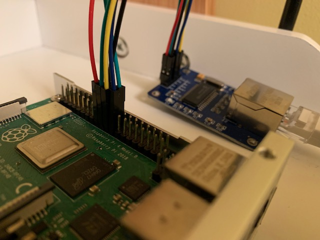

Writing a "bare metal" operating system for Raspberry Pi 4 (Part 14)
====================================================================

Bare metal Ethernet for under £10
---------------------------------
It's exciting to build your own OS, but until you give it the ability to communicate with the outside world, your possibilities are limited. Indeed, our simple Bluetooth comms got us up and running - but if we're to do anything meaningful then we need proper networking.

In this tutorial, we're going to connect to an external Ethernet controller (a network card, if you like) using the RPi4's Serial Peripheral Interface (SPI).

Things you'll need:

 * An [ENC28J60 Ethernet module](https://www.amazon.co.uk/dp/B00DB76ZSK) - it cost me less than £6 and was worth every penny (n.b. code only tested on this exact model)
 * Some [female-to-female jumper cables](https://www.amazon.co.uk/dp/B072LN3HLG) - cost me less than £2.50
 * An Ethernet cable to connect to your Internet router

Connecting up the ENC28J60 Ethernet module
------------------------------------------
I followed the very helpful instructions [here](https://www.instructables.com/Super-Cheap-Ethernet-for-the-Raspberry-Pi/).

We won't be connecting the interrupt line for now, so there are just six jumper leads (I've suggested colours) that need connecting:

 | Pi pin | Pi GPIO     | Jumper colour | ENC28J60 pin |
 | ------ | ----------- | ------------- | ------------ |
 | Pin 17 | +3V3 power  | Red           | VCC          |
 | Pin 19 | GPIO10/MOSI | Green         | SI           |
 | Pin 20 | GND         | Black         | GND          |
 | Pin 21 | GPIO09/MISO | Yellow        | SO           |
 | Pin 23 | GPIO11/SCLK | Blue          | SCK          |
 | Pin 24 | GPIO08/CE0  | Green         | CS           |

Here's a (not very useful) photo of my RPi4 connected correctly:

