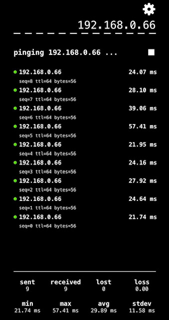

Writing a "bare metal" operating system for Raspberry Pi 4 (Part 15)
====================================================================

Adding a TCP/IP stack
---------------------
Having achieved "proof of life" from our Ethernet module in _part14-spi-ethernet_, you're doubtless wondering how to go from there to serving web pages, posting tweets on Twitter or perhaps even just simply responding to a ping!

This is where you'll need a fully-fledged TCP/IP stack that goes way beyond handcrafted ARPs, implementing many more protocols to achieve efficient bi-directional communication.

In this part we make use of some code from Guido Socher of [tuxgraphics.org](http://tuxgraphics.org/), designed to be a lightweight TCP/IP stack for embedded devices. I chose this because it was super simple to get working (or "port"), but you might want to look at [LwIP](https://en.wikipedia.org/wiki/LwIP) if you need something more advanced.

The code
--------
Most of the new code is in the _tcpip/_ subdirectory. I actually came across it in [this Github repository](https://github.com/ussserrr/maglev-ti-rtos) and, again, made only a very few cosmetic changes (`diff` is your friend!).

It did require me to expose the `strlen()` function we implemented in _lib/fb.c_, so that's added to _include/fb.h_. Similarly, we expose the `memcpy()` function we implemented in _kernel/kernel.c_, so that's added to _kernel/kernel.h_.

I also needed a single function that tells the ENC to send a packet. Nothing new here, just different packaging:

```c
void enc28j60PacketSend(unsigned short buflen, void *buffer) {
   if (ENC_RestoreTXBuffer(&handle, buflen) == 0) {
      ENC_WriteBuffer((unsigned char *) buffer, buflen);
      handle.transmitLength = buflen;
      ENC_Transmit(&handle);
   }
}
```

This was also added to _kernel/kernel.h_. Finally, _kernel/kernel.c_ now calls a function called `net_test()` instead of our original `arp_test()`.

The changes to _arp.c_
----------------------
We initialise the network card in exactly the same way but, when we're done, we call this function in Guido's code:

```c
init_udp_or_www_server(myMAC, deviceIP);
```

This tells the TCP/IP library who we are, so we're all on the same page!

Finally, and aside from a little cleanup, the major change is the new `net_test()` function:

```c
void net_test(void)
{
   while (1) {
      while (!ENC_GetReceivedFrame(&handle));

      uint16_t len = handle.RxFrameInfos.length;
      uint8_t *buffer = (uint8_t *)handle.RxFrameInfos.buffer;
      packetloop_arp_icmp_tcp(buffer, len);
   }
}
```

This is an infinite loop which waits for an incoming packet and then simply passes it to Guido's `packetloop_arp_icmp_tcp()` function. This function implements some useful things, like responding to pings. I modified the routine to print a message to the screen when it sends a "pong" (look from line 1381), so we can see when it's in action!

_Imagine my excitement when I built, ran and could ping my RPi4 at 192.168.0.66 and get a response to both my laptop and my iPhone!_

I recommend reading [this page](http://tuxgraphics.org/electronics/200905/embedded-tcp-ip-stack.shtml) to give you some ideas about what else you might achieve with Guido's library...


