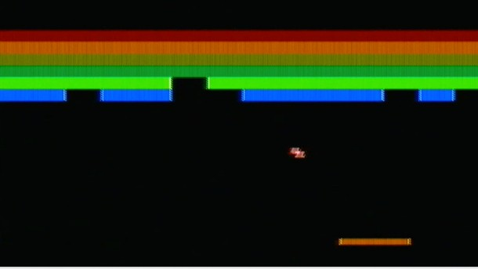
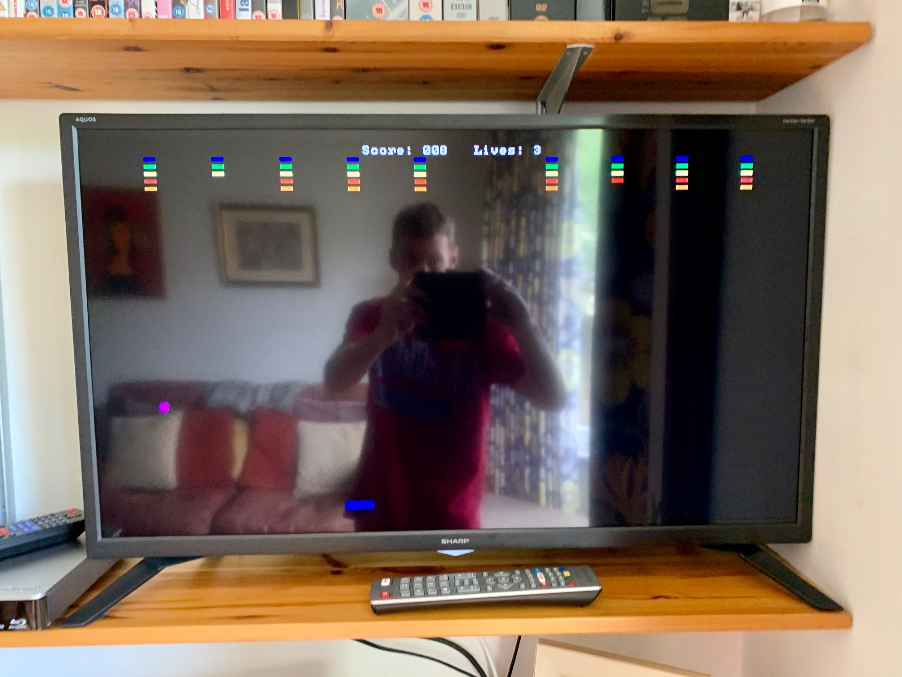

Writing a "bare metal" operating system for Raspberry Pi 4 (Part 6)
===================================================================

Introducing Breakout
--------------------

[Breakout](https://www.gameinformer.com/b/features/archive/2015/10/09/how-steve-wozniak-s-breakout-defined-apple-s-future.aspx) is a classic arcade game that has a paddle (or bat), which you move along a horizontal axis at the bottom of the screen. At the top of the screen are rows of bricks. A ball bounces around the screen, rebounding off the bat and off the bricks, which are "knocked out" when directly hit. The goal is to knock out all of the bricks with the ball. If you don't get to the ball in time, and it escapes the bottom of the screen, you lose a life. You typically have 3 lives before Game Over.

Amazingly, we have all the components we need to build our version of [Steve Wozniak](https://en.wikipedia.org/wiki/Steve_Wozniak)'s classic.



A tweak to our drawing code
---------------------------

If you're also running in 1080p, then you'll note that our 8x8 font is rather small on the screen. Let's tweak `drawChar` to take a `zoom` parameter so our game players don't need to have their noses against the TV!

```c
void drawChar(unsigned char ch, int x, int y, unsigned char attr, int zoom)
{
    unsigned char *glyph = (unsigned char *)&font + (ch < FONT_NUMGLYPHS ? ch : 0) * FONT_BPG;

    for (int i=1;i<=(FONT_HEIGHT*zoom);i++) {
        for (int j=0;j<(FONT_WIDTH*zoom);j++) {
            unsigned char mask = 1 << (j/zoom);
            unsigned char col = (*glyph & mask) ? attr & 0x0f : (attr & 0xf0) >> 4;

            drawPixel(x+j, y+i, col);
        }
        glyph += (i%zoom) ? 0 : FONT_BPL;
    }
}
```

We're just changing our loops to increase the column height and row width by our scale factor `zoom`. With `zoom` set to 2, for example, our 8x8 bitmap will actually be rendered as a 16x16 bitmap. To understand the logic required within the loop, it helps me to visualise the desired output:

```c
0 0 0 0 1 1 0 0 -> 0 0 0 0 0 0 0 0 1 1 1 1 0 0 0 0 
                   0 0 0 0 0 0 0 0 1 1 1 1 0 0 0 0 
0 0 0 1 1 1 1 0 -> 0 0 0 0 0 0 1 1 1 1 1 1 1 1 0 0 
                   0 0 0 0 0 0 1 1 1 1 1 1 1 1 0 0 
0 0 1 1 0 0 1 1 -> 0 0 0 0 1 1 1 1 0 0 0 0 1 1 1 1 
                   0 0 0 0 1 1 1 1 0 0 0 0 1 1 1 1 
0 0 1 1 0 0 1 1 -> 0 0 0 0 1 1 1 1 0 0 0 0 1 1 1 1 
                   0 0 0 0 1 1 1 1 0 0 0 0 1 1 1 1 
0 0 1 1 1 1 1 1 -> 0 0 0 0 1 1 1 1 1 1 1 1 1 1 1 1
                   0 0 0 0 1 1 1 1 1 1 1 1 1 1 1 1
0 0 1 1 0 0 1 1 -> 0 0 0 0 1 1 1 1 0 0 0 0 1 1 1 1  
                   0 0 0 0 1 1 1 1 0 0 0 0 1 1 1 1  
0 0 1 1 0 0 1 1 -> 0 0 0 0 1 1 1 1 0 0 0 0 1 1 1 1  
                   0 0 0 0 1 1 1 1 0 0 0 0 1 1 1 1  
0 0 0 0 0 0 0 0 -> 0 0 0 0 0 0 0 0 0 0 0 0 0 0 0 0 
                   0 0 0 0 0 0 0 0 0 0 0 0 0 0 0 0 
```

It's clear that we want to repeat each bit `zoom` times to fill the wider row (horizontal zoom). And we then want to repeat the entire line `zoom` times to fill the taller column (vertical zoom).

To achieve the former, we simply advance our bitmask one in every `zoom` times instead of every time. We make use of integer rounding thus:

```c
zoom=1                     zoom=2
j=0 : (j / zoom) = 0       j=0 : (j / zoom) = 0
j=1 : (j / zoom) = 1       j=1 : (j / zoom) = 0
j=2 : (j / zoom) = 2       j=2 : (j / zoom) = 1
j=3 : (j / zoom) = 3       j=3 : (j / zoom) = 1
j=4 : (j / zoom) = 4       j=4 : (j / zoom) = 2
j=5 : (j / zoom) = 5       j=5 : (j / zoom) = 2
j=6 : (j / zoom) = 6       j=6 : (j / zoom) = 3
j=7 : (j / zoom) = 7       j=7 : (j / zoom) = 3
...                        ...
```

So, that sorts out our horizontal zoom. To achieve the vertical zoom, it's a similar solution. Instead of advancing our glyph pointer by the number of bytes per line on each iteration, we do it one in every `zoom` iterations by making use of the **modulo** operator (I think of this as "remainder after division"). If `i` divided by `zoom` has no remainder then we advance our glyph pointer, otherwise we leave it where it is!

```c
zoom=2
i=1 : (i % zoom) = 1
i=2 : (i % zoom) = 0 -> advance the pointer 
i=3 : (i % zoom) = 1
i=4 : (i % zoom) = 0 -> advance the pointer
i=5 : (i % zoom) = 1
i=6 : (i % zoom) = 0 -> advance the pointer
i=7 : (i % zoom) = 1
i=8 : (i % zoom) = 0 -> advance the pointer
...
```

Perhaps you can see why we changed our outer loop to count from 1 rather than 0?

If you want, you can now make these changes to _fb.c_ in your part5-framebuffer code and exercise them properly in _kernel.c_ to check that they work. Don't forget to update the function definition in _fb.h_ to include the `zoom` parameter too.

It is also now trivial to modify `drawString` to take a `zoom` parameter and pass it through, so I won't document the changes here.

Object tracking
---------------

As we can now draw text (e.g. a score/lives counter), rectangles (paddle & bricks) and circles (ball), we can recreate the Breakout game screen. Check out `initBall()`, `initPaddle()`, `initBricks()` and `drawScoreboard(score, lives)` in our new _kernel.c_.

In addition to the graphics code, you'll see that we're keeping a record of each game object we create in the global `objects` array:

 * its (x, y) coordinates
 * its width & height
 * what type of object it is (ball, paddle or brick)
 * whether it's "alive"

We also store a global pointer to the ball and paddle object, so they're easy to track down!

As we'll need to knock out our bricks during gameplay, we create `removeObject(object)`, which simply draws a filled black rectangle over the object we pass, and sets its `alive` parameter to 0 to signal that it's now out of play.

To know that our ball is about to hit a brick (or indeed the paddle), we'll need to detect **collisions**. We simply conduct a search of the alive objects and return the first object we find whose coordinates overlap. If no object is found, we return 0. `detectCollision(object, xoff, yoff)` implements this. Note that `xoff` and `yoff` can be negative since the ball could be travelling in any direction.

Keyboard input
--------------

We'll be using the UART to take input, just like we did in part4-miniuart.

`getUart()` simply checks if a key has been pressed and, if so, it returns the character, otherwise 0. We don't want this function to wait for a key, because gameplay needs to continue regardless.

Animating the gameplay
----------------------

Let's look at the new `main()` routine which controls the gameplay. Most of the initialisation code should be familiar to you, and the endgame of "Game over" or "Well done!" should also be clear. I'll therefore focus on the function of the inner loop.

First, we check if we need to move the paddle. We'll move it left if we get a keypress of "h", and right if we get a keypress of "l". I would use the arrow keys normally, but they're a little harder to capture over the UART so we'll keep it simple for now.

We now implement another function `moveObject(object, xoff, yoff)` to make these moves. This starts by calling another routine I've implemented in _fb.c_ to move a rectangular bitmap from one screen location to another, leaving only the background colour behind. It's a sloppy implementation, but it will do for now.

With our paddle logic in place, let's deal with the ball. We've set some initial velocities but, before we actually move the ball, we need to check for collisions. If we're about to hit a brick, we:

 * remove that brick using `removeObject`
 * reverse our vertical direction
 * increment the score 
 * redraw the scoreboard

If we're about to hit the paddle, we:

 * reverse our vertical direction 
 * make any necessary changes to our horizontal direction (in case we hit the side)

We can then actually move our ball after a slight delay so gameplay isn't too fast! The delay code is implemented in _fb.c_ and uses the on-board timer on the ARM.

Finally, we just need to make sure we ball is in the game arena. We bounce it off the sides if we need to, but if it escapes the bottom of the screen then we lose a life and reset the paddle & ball. This is easy enough since we can just remove them and create new ones!

Conclusion
----------

I hope writing your first game was easier than you thought it might be - and on bare metal too. It's pretty simple, granted, but once you've built it and got it going on your RPi4, I bet you'll be just a little bit addicted. I know I am!

_Well done, you've just written your first game!_


